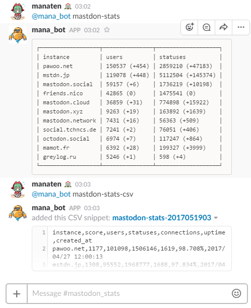

# mastodon-stats-bot
A slack bot collecting statistics of mastodon instances.

---

# What

A slack bot collect and report statistics of top mastodon instances using https://instances.mastodon.xyz/list .
Collected datas are stored into local sqlite database.



# Running bot

## Install

Using node.js and [yarn](https://yarnpkg.com/lang/en/).

```
yarn
```

## Environment variables

- `HUBOT_SLACK_TOKEN` - A slack token for slack bot. Required.
- `SLACK_CHANNEL` - A slack channel id for reporting.
- `SQLITE_PATH` - path of sqlite db. Default is `./data.db` .

## Start bot

```
yarn start
```
